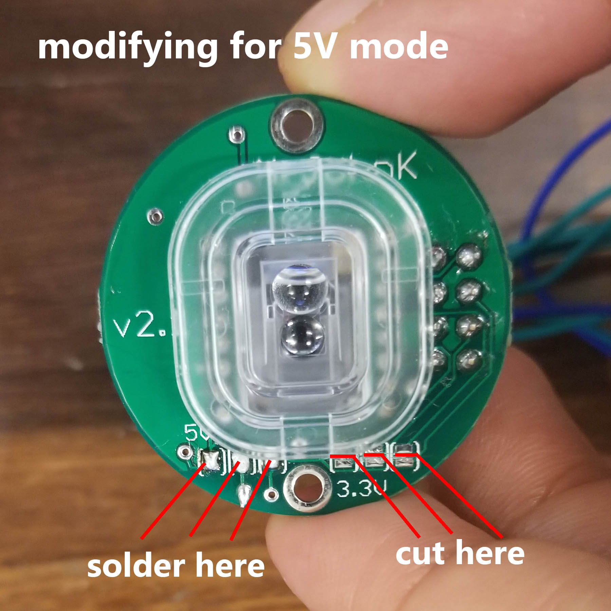
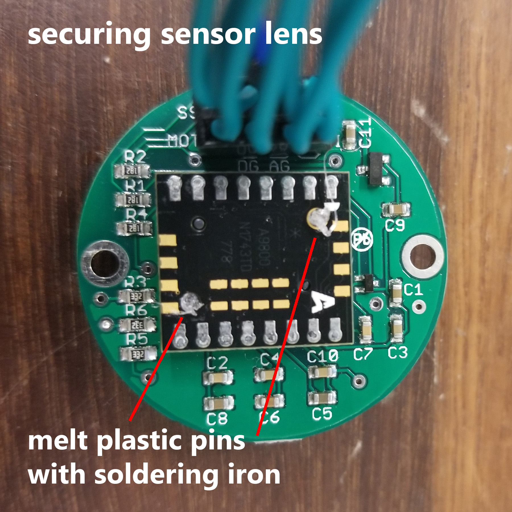

Things I've learned so far about the ADNS-9800 sensor that we used to sense motion like an optical mouse does. Purchased breakout board from [here][1].

# Hardware
* The ADNS can run on 3.3V or 5V logic. However, the breakout board ships with 3.3V mode configured. The Arduino Uno we are using runs on 5V logic, so I followed the board maker's instructions for enabling 5V mode. To provide a visual for their instructions, a picture below:

* The sensor lens also does not come secured to the rest of the board components, so I slightly melted the two plastic pegs so that they wouldn't fall out of their slots.

# Software (Arduino)
* The board maker's code from [their GitHub (mrjohnk - Arduino Example Sketches)][2] are written for an older version of Arduino, and for a Teensy. This person's [implementation (rpriyadarshi)][3] is up to date, and has documentation specific to an Arduino Uno. The rpriyadarshi version makes much more efficient use of embedded C, but might be more opaque to newer Arduino users. 

* Definitely read the [data sheet][4], even just skimming it. Especially look at the diagrams (p15) for the datapaths of what exactly happens when you read/write to the sensor. A new user doesn't have to worry about all the details of the timing, since read, write, SROM load, and other operations have been implemented already in the example code from both [mrjohnk][2] and [rpriyadarshi][3].

* The rpriyadarshi version implements motion burst reading, which gets a much better frame rate for motion capture than the regular read operation. 

[1]: https://www.tindie.com/products/jkicklighter/adns-9800-laser-motion-sensor/
[2]: https://github.com/mrjohnk/ADNS-9800
[3]: https://github.com/rpriyadarshi/ADNS9800_LCD/blob/master/ADNS9800.h
[4]: https://datasheet.octopart.com/ADNS-9800-Avago-datasheet-10666463.pdf
