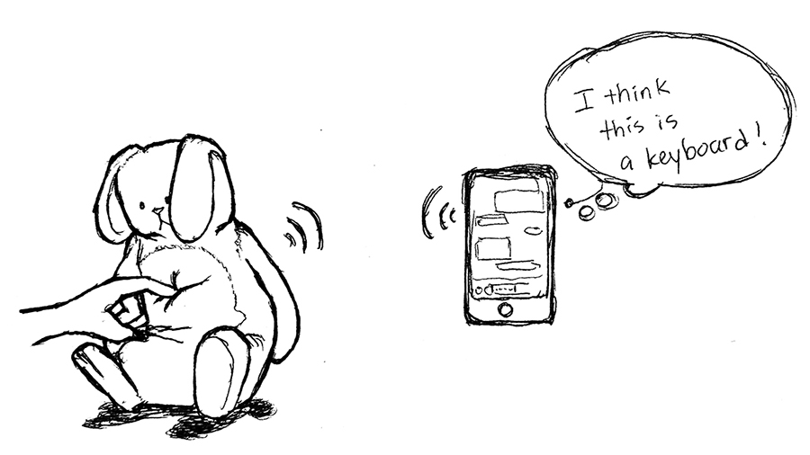
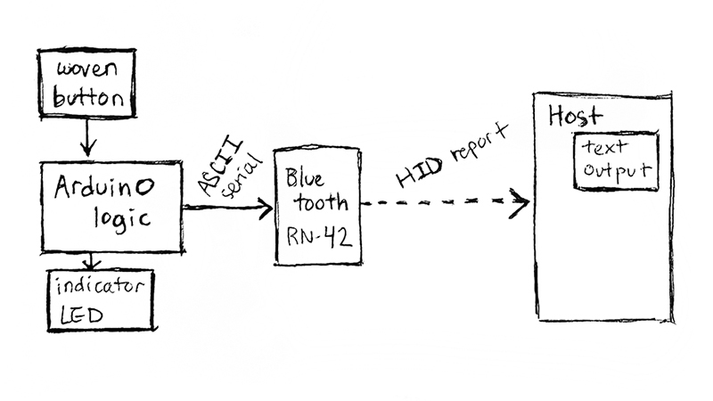
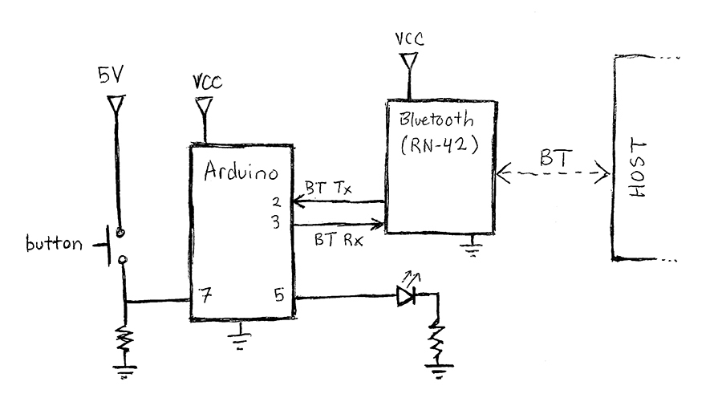
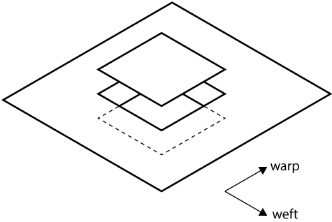
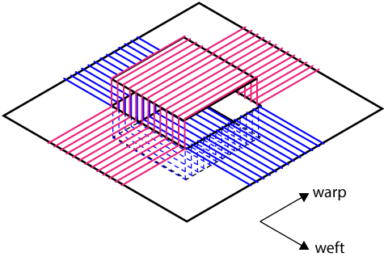

# {{ page.title }}

Spring 2019

## Concept

Concept sketch of a Bluetooth fabric-based controller.

### Description: Motivation & Goals

My goal was to learn as much as I could about the Bluetooth connectivity standard and apply the knowledge to create a system that incorporated Bluetooth into a smart textile. After some initial research into the components accessible to me, I began to design a soft, fabric-based Bluetooth input device that smartphones and other Bluetooth-enabled devices could easily connect to. The final design demonstrates a woven Bluetooth button which types a phrase on the other device when pressed.

### Components

#### Main Components

* Arduino Uno
* [Sparkfun Bluetooth Mate Silver](https://www.sparkfun.com/products/12576)
* Other Bluetooth-enabled device
* Woven press button
 * Conductive yarn
 * Non-conductive, soft yarn (e.g. wool or acrylic)

#### Tools

* [Pin loom](https://woolery.com/schacht-zoom-loom.html) (or other weaving loom)
* Crimper
* Soldering iron

#### Other Materials

* Resistors
* Breadboard
* Jumper wires

### Block Diagram

Block diagram showing the flow of input/output data between the system's major components. The device that connects to the Bluetooth module is the host.

### Circuit Diagram

Circuit incorporating the button, Arduino, Bluetooth module, and an indicator LED. A 10KOhm resistor is connected between the button pin (7) and GND. A 100 Ohm current-limiting resistor is connected in series with the LED on pin 5.

## Instructions

These instructions are specific to the RN-42 module, so another breakout board may be substituted. A conventional press button may also be substituted. (An overview of how to create a woven button is in the appendices.) If substituting a different Bluetooth module, it must support Bluetooth's HID profile.

### Setup, Initial Configuration, and Pairing

1. Connect all components as shown in the schematic. The Arduino's 5V pin may be used for the button and VCC on the Bluetooth module. When the RN-42 module is powered, you will see a slowly blinking red LED, indicating that it is in pairing mode.
2. Load the **wovenButton_simple** code ([GitHub](https://github.com/sminliwu/SW-connectedthings/tree/master/BluetoothFabric/code)) onto the Arduino. If you want a simple Bluetooth serial pipeline between the Arduino and host, load the **BTpipeline** code instead. The indicator LED should light up when the button is pressed. If the button presses are too noisy, load the **wovenButton_debounced** version instead.
3. Open the serial monitor to configure the RN-42.
4. Switch the serial monitor from "Newline" to "No line ending" on the bottom dialog. Then, send "**$$$**" to the module to switch it to command mode. You should see the red LED on the module begin blinking much more quickly. (for details on what these commands actually mean, see the user's guide linked at the end)
5. Send the command "**SN**, _&lt;something unique&gt;_" to rename the module to something you will easily recognize. Send "**D**" to see the new name, as well as your module's pincode. (by default, it's 1234. You can set a custom pin using "**SP**, _&lt;\#\#\#\#&gt;_")
6. Send "**---**" to exit command mode and return to pairing mode.
7. Open the Bluetooth settings on another device, such as your smartphone or laptop, scan for the module, and pair with it. Enter the PIN code when prompted.
8. Your device should now be connected as the host to the RN-42. You'll need to monitor a serial port on the host (e.g. a terminal emulator on a PC, or apps for your phone) to communicate back and forth, but now the host and RN-42 can talk to each other!

### Configuring for Button Input
1. Re-enter command mode on the RN-42. Enter "**S~, 6**" to set the module's profile to HID (Human Interface Device).
2. Enter "**GH**" to check the HID flag register. It should be 0000 by default, which tells the host that the device is a keyboard. If it's anything different, enter "**SH, 0000**".
3. Enter "**SA, 2**" to set the authentication mode to SSP (simple secure pairing) to make connecting to the module much easier.
4. Exit command mode. Unpair your device with the module, and scan for it again. The module should show up as a keyboard now!
5. Re-connect with the module. You should not need to enter any authentication code.
6. Open a text input on your device, like any messaging service. Press the button and watch the spam stream in!

## Additional Information

### Weaving a Smart Textile Button

Weaving makes a fabric by interlacing two perpendicular sets of yarn, the warp (conventionally vertical) and the weft (horizontal). The warp is first set up on the loom ("warping" the loom) and held under tension. Then, the weft is passed across the warp yarns, going over and under periodically, to interlace and form the fabric structure. One particular woven structure, doubleweave, actually forms two separate layers during the weaving. Using this structure in a specific area can create a pocket in that area, as shown in the drawing below.

Drawing of the base structure of the woven button. The button itself is made of a two-layered woven structure, bound together by the ground plane of the surrounding fabric.

During the weaving process, we can add in a "supplemental" yarn that follows the base yarn to "supplement" the structure in selected portions. This yarn can be in either direction, making supplemental warp or supplemental weft. The supplemental yarn does not have to be as sturdy as the base yarn in the rest of the fabric, giving us a way to easily use fragile conductive yarn.  On this button, I used stainless steel conductive yarn as supplemental warp to cover the top face of the button and form one terminal. Supplemental weft using the same yarn formed the bottom face of the button, the other terminal. I stuffed the pocket with scraps of yarn to separate the terminals.

Drawing of the button showing the location of supplemental warp (pink) and supplemental weft (blue).

### Bluetooth Overview

Bluetooth was developed with the ambitious goal of replacing wired USB (Universal Serial Bus) connections. One of USB's most successful features is its ability to easily interpret input/output from a variety of devices, greatly reducing how many different connectors computer systems had to handle. USB was created to replace an even earlier communication standard, RS-232 serial. USB's universal-ness comes from its host controller architecture, which adds several layers of abstraction between the "host" computer and the connected device, so that the host doesn't have to handle as many specifics of the peripheral device. In Bluetooth, a similar layered architecture is what we call the "Bluetooth stack".

To connect to a USB device, the USB host installs a driver that corresponds to the device. Often, these drivers can work across an entire category of device (e.g. keyboard, speakers) because they are defined for a "profile" that generalizes the category. Many USB device profiles were ported directly into Bluetooth profiles, informing some of the core design features of this newer connectivity standard. My design takes advantage of this embedded history within Bluetooth systems by using the Bluetooth profile of a keyboard.

#### RN-42 Bluetooth Module
Sparkfun's Bluetooth Mates and SMiRF's both use this module in the Silver versions. The gold versions of both boards use the RN-41 module, which has a larger range but similar connectivity capabilities. The difference between Mates and SMiRF's, which are both breakout boards for RN modules, is the pin order which affects which Arduinos can directly plug into them. Both boards have 6 pins that can directly connect to an Arduino's UART pins.

The RN-42 module can be used in Serial Port Profile (SPP) or in Human Interface Device (HID) profile. The configured profile will affect how the device at the other end sees and connects to it.

Link to complete [user's guide](https://cdn.sparkfun.com/datasheets/Wireless/Bluetooth/bluetooth_cr_UG-v1.0r.pdf) (advanced).

#### Bluetooth SPP w/ RN-42
The Bluetooth SPP profile is used to replace a wired serial TTL (transistor-transistor logic) connection. Information is transmitted in packets with very little overhead. Both devices must be able to listen and write to a serial port in order to communicate via SPP.

#### Bluetooth HID w/ RN-42
The Bluetooth HID profile is, in fact, a wrapper to the USB HID profile. The HID device interprets input commands as ASCII characters and translates them into packets of bytes, or HID reports. The host receives the reports and converts them to the appropriate output. In the case of keyboards, the information often starts and ends as ASCII, so a string sent by the Arduino via the RN-42 will show up exactly the same on the other end.

## Other Resources
* [Set-up tutorial for RN-42 modules from Sparkfun](https://learn.sparkfun.com/tutorials/using-the-bluesmirf/all)
* [RN-42 user's guide](https://cdn.sparkfun.com/datasheets/Wireless/Bluetooth/bluetooth_cr_UG-v1.0r.pdf)
* [Bluetooth HID user's guide by RN](https://cdn.sparkfun.com/datasheets/Wireless/Bluetooth/RN-HID-User-Guide-v1.0r.pdf)
* [USB Explained](https://www.amazon.com/USB-Explained-Steven-McDowell/dp/013081153X) by McDowell & Seyer, a reference book for the specifics of USB connectivity and several other communication standards
