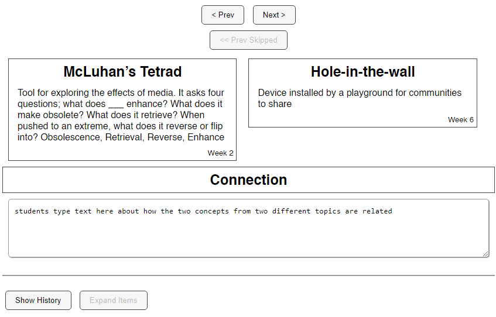
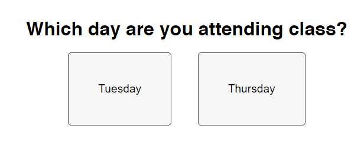

## Summary

A simple web app that I made as a classroom tool, which helped students generate novel connections between concepts from different course topics. Because the instructor (for whom I was the TA) and I couldn't find a tool that did exactly what we wanted, and I decided it was easier for me to code my own than to continue looking for one/a few to hack for our purposes.

## Instructional Use

A detailed account of how this tool was used during our class sessions, and further context on how it served the teaching goals for the course.

### The Course

During the SP2022 semester, I was the graduate TA for [ATLS2000: The Meaning of Information Technology](https://catalog.colorado.edu/courses-a-z/atls/). This introductory-level course surveys the history of information/communication technologies (ICT) and contemporary issues of ICT applications on humans such as social and political change, psychological and cognitive effects, and environmental impacts. It covers a lot of topics.

Each week focuses on a different topic, and with material covering everything from the history of computers, to the influence of algorithms on existing social biases, to the future of work -- there's not much time week-to-week for students to synthesize information between topics. Exams, like the midterm, actually offer an opportunity to "integrate" the weekly units because students are reviewing while they study anyway.

### Classroom Activity - Part 1

The planned instructional activity was part of the course midterm. Part 1 of the activity divided the students into small groups of 3-5 and assigned a weekly topic to each group. We shared a Google document to all the groups to edit simultaneously. To prevent this process from being complete chaos, the document was already set up with one single page (with pagebreak) per group, their assigned topic, and a blank table where they would enter their responses.

In these groups, the students recalled the terms and concepts discussed in that week's content and wrote brief definitions for each. As this part of the "in-class midterm" was designed to generate the data for the combo generator web app, we required the students to format their lists of terms and concepts like so:

> <weekly topic title>
>
> Idea / Key Term
>
> Definition
>
> <term or concept 1>
>
> <short definition, 1-3 sentences>
>
> <term or concept 2>
> <short definition, 1-3 sentences>
>
> <term or concept 3 and beyond...>
> <short definition, 1-3 sentences>

As an example, here is an excerpt from a student list of key terms and definitions for the weekly topic, "Black Box of Algorithms":

> Black Box of Algorithms
>
> Idea / Key Term
> Definition
>
> ADT (AWS)
> Automated decision systems, spin-off: automated weapons systems for robotic warfare technology. Often used
> because we do not want to make decisions that include many factors
>
> Black Box of Algorithms
> The idea that a company creates an algorithm for another without the end user knowing how it functions and
> what factors it uses
>
> Big Data
> The multitudes of data associated with multiple aspects of people and group’s interests, demographics, and history

Once the students had completed their lists of terms/definitions for their topics, we compiled the lists into a carefully-formatted plain-text (.TXT) file. At this point, we took a brief (10-15 minute) break for class, which gave us time to push the updated .TXT file to the server, populate the random generator tool with the students' work, and troubleshoot any minor typos or glitches with the web app.

### Classroom Activity - Part 2

Here's where the students actually used the tool. With all of their combined work, all the weekly topics and every group's list of terms, the generator web app would show random combinations of two terms from different weeks, with their definitions, and ask the students to explain how they thought the two concepts were connected. This comprised the remainder of class time. Students viewed and/or filled out as many combos as they felt appropriate, until they had their top three connections to submit for the graded assessment. To give a better idea of the different topics that students were connecting, the weekly topics were:

* Week 2: "Computers and Thinking Frameworks"
* Week 3: "Internet and Net Neutrality"
* Week 4: "Black Box of Algorithms"
* Week 5: "Diversity and Representation"
* Week 6: "Digital Divides and ICTD"

More on the actual interface in the next section.

## Interface

Here's a more thorough walkthrough of the web app's interface as a student would have seen it during the classroom activity.

Because we had the class divided into two sections that would attend class on different days (and thus, two different datasets of terms and definitions), the student first selects their course section on the welcome prompt.

Then, they are taken to the main interface, which would show a random combination of two terms from different weekly topics. The terms are shown as "cards" with the term on the top line, its definition in the center, and the week in the lower-left corner (which also lets us verify that the combinations are being properly generated).

Below the cards, the student would type their explanation for the connection between the two terms in the given text input area. Above the term cards, the student can change the displayed combo by clicking the "next" or "previous" button. Generally, the "next" button will show the student a new combo with two different terms. If the student has already seen multiple combos, the "previous" button will let them scroll back through previous combos, all the way until the first one. If they are viewing a previous combo, the "next" button will let them scroll forward within their history until they reach the most-recently generated combo, after which the "next" button will resume showing them new combos. If the student leaves the connection text blank, and goes to view a different combo, the one they were previously viewing will register as "skipped".

As the student progresses through more combinations, they can view the entire log of their session by clicking "View History" below the text input area. This will open an alternate view of the concepts and connections, displaying them in a table rather than one at a time.

## Technical Implementation

Because the whole goal for making this tool was getting the most function (and the minimum viable prototype) in the least amount of time, I used the environments I was most familiar with, which is client-side JavaScript embedded in HTML/CSS. The full list of components:

* JavaScript (with JQuery)
* HTML/CSS
* .TXT file data
* Firebase Hosting

"Function" in this case also included the ability to quickly get student responses into the the source code, as well as the ability to get the tool in front of students' faces. For the former, I had a hunch that I could get some sort of raw text blob served with the webpage content, hence the .TXT file to act as an intermediate format between the class Google doc and the text data. For hosting the web app, I had recently learned how to properly use Firebase, and I felt comfortable enough with the platform to deploy changes to a hosted app while also running a class.

I want to try writing more about my coding and other technical processes, so I'll break down my logic further for some specific sections of the code. You can find all of the app's assets in this GitHub repo. I'll mostly be referring to the JavaScript file, `script.js`. \[LINKS\]

### .TXT File Loading and Parsing

The first open question I had to solve was, "How do I get a .txt file into JavaScript?" Luckily, I found this [StackOverflow question](https://stackoverflow.com/questions/4533018/how-to-read-a-text-file-from-server-using-javascript) from a user trying to do the same thing. Keeping things simple and hacky, I used the top answer's hack of including the text file in a hidden HTML `<iframe>`. From the HTML element, the JS code could then execute a bound function `loadFile()`, that extracted the text file's contents as a gigantic string. It's not the most efficient way to do it, and since I was already using JQuery, I could have also used AJAX, but I'm just more experienced with grabbing absurdly-nested attributes from the DOM.

Next, once the .TXT had been loaded, the code had to parse its contents to populate the app with the students' responses, and to properly generate random combinations of these responses. The _careful_ formatting from Part 1 of the activity was crucial here; my not-so-smart code needed the weekly topic headings, key terms, and their definitions to all be consistently separated and ordered, or else the displayed data would be unusable. The longest function in my code (30 lines compared to 20 or less for the others), `parseData()`, handles this logic, and you can find a much more thorough explanation in the [code walkthrough](./code-walkthrough).

### Helper Classes: Item and Combo

To structure the data once it was parsed, I created two classes that represented the main units of the activity: `Item` (a key term) and `Combo` (an associated pair of `Items`).

The `Item` class is purely an object that stores the attributes of a key term contributed by students. With the key term as the object's `name`, each `Item` also has an arbitrary `id` number, which weekly topic it came from (keyed by the `week` number), and the key term's definition (`def`). I didn't need to write any methods for this class.

The `Combo` class primarily stores a link between two specific `Items`, with some extra convenience functions.

### "Random" Generation

## Possible Improvements

## References

* https://stackoverflow.com/questions/4533018/how-to-read-a-text-file-from-server-using-javascript