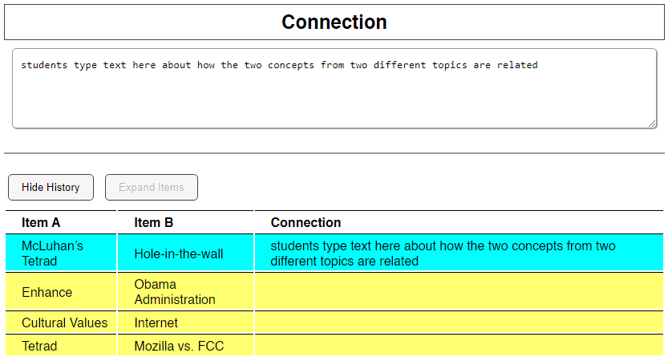

## Summary

A classroom tool I made for students to generate novel connections between concepts from different course topics. Because the instructor (for whom I was the TA) and I couldn't find a tool that did exactly what we wanted, and I decided it was easier for me to code my own than to continue looking for one/a few to hack for our purposes.

## Instructional Use

### The Course

During the SP2022 semester, I was the graduate TA for [ATLS2000: The Meaning of Information Technology](https://catalog.colorado.edu/courses-a-z/atls/). This introductory-level course surveys the history of information/communication technologies (ICT) and contemporary issues of ICT applications on humans such as social and political change, psychological and cognitive effects, and environmental impacts. It covers a lot of topics.

Each week focuses on a different topic, and with material covering everything from the history of computers, to the influence of algorithms on existing social biases, to the future of work -- there's not much time week-to-week for students to synthesize information between topics. Exams, like the midterm, actually offer an opportunity to "integrate" the weekly units because students are reviewing while they study anyway.

### Classroom Activity

The planned instructional activity was part of the course midterm. Part 1 of the activity divided the students into small groups of 3-5 and assigned a weekly topic to each group. In these groups, the students recalled the terms and concepts discussed in that week's content and wrote brief definitions for each. As this part of the "in-class midterm" was designed to generate the data for the combo generator tool, we required the students to format their lists of terms and concepts like so:

> <weekly topic title>
> Idea / Key Term
> Definition
>
> <term or concept 1>
> <short definition, 1-3 sentences>
>
> <term or concept 2>
> <short definition, 1-3 sentences>
>
> <term or concept 3 and beyond...>
> <short definition, 1-3 sentences>

As an example, here is an excerpt from a student list of key terms and definitions for the weekly topic, "Black Box of Algorithms":

> Black Box of Algorithms
>
> 
> Idea / Key Term
> Definition
>
> ADT (AWS)
> Automated decision systems, spin-off: automated weapons systems for robotic warfare technology. Often used
> because we do not want to make decisions that include many factors
>
> Black Box of Algorithms
> The idea that a company creates an algorithm for another without the end user knowing how it functions and
> what factors it uses
>
> Big Data
> The multitudes of data associated with multiple aspects of people and group’s interests, demographics, and history

Once the students had completed their lists of terms/definitions for their topics, we compiled the lists into a plain-text (.TXT) file.

## Interface

## Technical Components

* JavaScript (with JQuery)
* HTML/CSS
* .TXT file data
* Firebase Hosting

## References