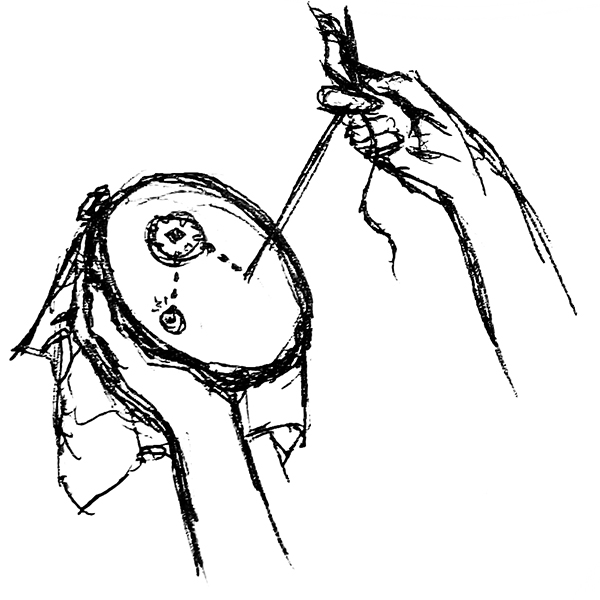
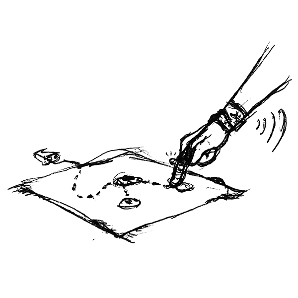
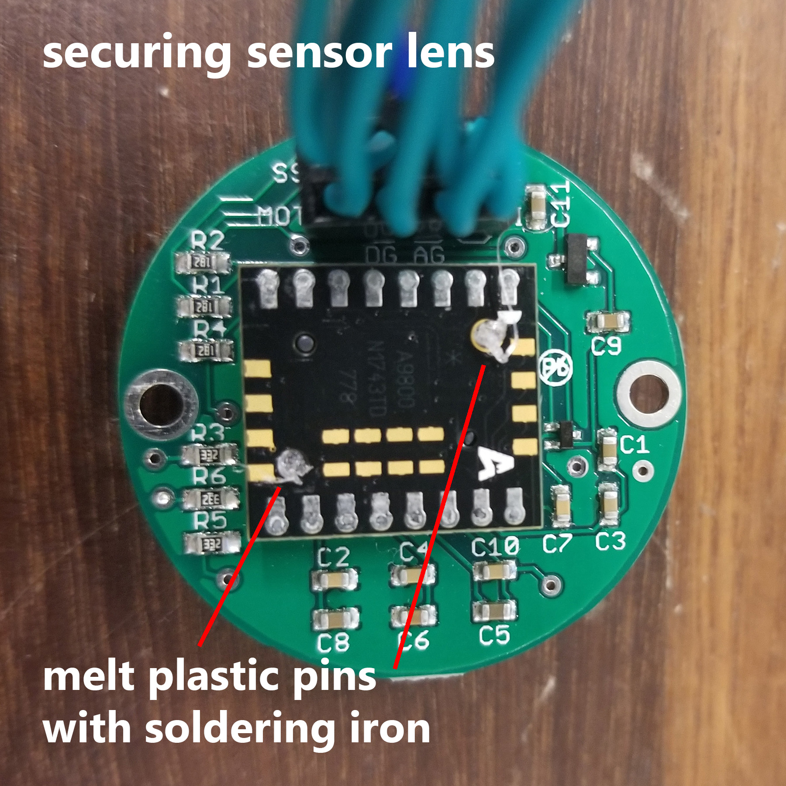

## [Visualization Web App](/projects/ETextileMultimeter/main)

## Concept

<table style="width: 100%; border-collapse: collapse; margin-left: auto; margin-right: auto;" border="0" cellspacing="0" cellpadding="0"> <tbody> <tr>
<td style="width: 33.3333%;">

Prototyping

</td>
<td style="width: 33.3333%;">

Testing

</td>
<td style="width: 33.3333%;">

Visualization

</td>
</tr></tbody></table>

An e-textiles design workflow showing how the multimeter might be used after prototyping to test and visualize the design.

### Description: Motivation & Goals

Both of us work in e-textiles and run into several obstacles during the design process. Like many other kinds of making, our process involves prototyping, analyzing or diagnosing the design, debugging, and then iterating. In e-textiles, there aren’t many tools to support the diagnosis and debugging stages. For this project, we would like to build upon Rona’s ongoing work in creating a wearable e-textile multimeter and extend its capabilities. The tool currently indicates continuity in an e-textile circuit through an LED, which helps the user identify any shorts or breaks in their sewn or woven circuit.

Our proposed design for this e-textile diagnostic tool will add a digital representation to the e-textile multimeter, visualizing the circuit layout while the multimeter is in use. Translating from the physical iteration will give the user deeper insights during their design process. This real-time feedback will let the user move more quickly through iterations and debug more efficiently.

### Components

<table style="width: 100%;">
<tbody>
<tr>
<td style="width: 50%;">

<strong>Electronics</strong>

<ul>
<li>Arduino Uno</li>
<li>Sparkfun Bluetooth Mate Silver</li>
<li>ADNS-9800 motion sensor</li>
<li>Other Bluetooth-enabled device</li>
<li>Soft multimeter probe
<ul>
<li>Soft jumper wires </li>
<li>LED</li>
<li>Conductive threads </li>
</ul>
</li>
</ul>
</td>
<td style="width: 50%;">

<strong>Materials</strong>

<ul>
<li>Fabric</li>
<li>Snap connectors</li>
<li>Cotton/non-conductive yarn</li>
</ul>

<strong>Tools</strong>

<ul>
<li>Soldering iron</li>
<li>Sewing needle</li>
</ul>
</td>
</tr></tbody></table>

### Block Diagram

Block diagram showing connections for motion sensor, Bluetooth module, and data flow into the visualizer. (click for hi-res)

### Probe Circuit Schematic

Schematic showing how to connect the Arduino and probe to the test circuit.

## Instructions

### Modifying the ADNS Motion Sensor for 5V mode

<table style="width: 100%; border-collapse: collapse;" border="0" cellpadding="0">
<tbody><tr>
<td style="width: 50%;">

<strong>1.</strong> The ADNS can run on 3.3V or 5V logic. The breakout board ships in 3.3V mode. If you are using a microcontroller that runs on 5V logic (e.g. Arduino Uno), follow the board maker’s instructions for enabling 5V mode as shown above. Use an Exacto knife or fine blade to cut the traces.

</td>
<td style="width: 50%; vertical-align: top;">

<strong>2.</strong> The sensor lens does not come secured to the rest of the board, so use a soldering iron to slightly melt the two plastic pegs so they won’t fall out of their slots.

</td>
</tr></tbody></table>

### Arduino & Bluetooth Set Up and Pairing

<ol>
<li>Connect the Arduino Uno, RN-42 Bluetooth module, and ADNS motion sensor as shown in the block diagram. <a href="https://cdn.tindiemedia.com/images/resize/WKNelWheBozH4EhsI_s1RjeWf5k=/p/full-fit-in/1378x1034/i/3333/products/2016-05-29T15%3A12%3A00.327Z-ADNS-9800%20to%20Uno.jpg">This is a more detailed diagram of the ADNS to Arduino connection. </a>Make sure to connect <em>both</em> GND pins on the sensor. The MOT pin is not necessary to run the code. Power the ADNS with 5V and the RN-42 with 3.3V. When the RN-42 module is powered, you will see a slowly blinking red LED, indicating that it is in pairing mode. Additionally, connect pin 5 on the Arduino to GND to keep the device inactive.</li>
<li>Load the <strong>ADNS_Bluetooth_burstmotion </strong>code (<a href="https://github.com/sminliwu/sminliwu.github.io/blob/master/projects/ETextileMultimeter/Arduino/ADNS_Bluetooth_burstmotion.ino">GitHub</a>) onto the Arduino. Open the serial monitor and wait for the ADNS firmware to finish uploading. You will see "Optical Chip Initialized" and some register readings when it is complete. If you see all zeros from the registers, such as the Product_ID and SROM_Version, that's a sign that the sensor is not properly connected.</li>
<li>Now to configure the RN-42. Switch the serial monitor from “Newline” to “No line ending” on the bottom dialog. Then, send “<strong>$$$</strong>” to the module to switch it to command mode. You should see the red LED on the module begin blinking much more quickly. </li>
<li>Switch the serial monitor back to "Newline". Send the command “<strong>SN</strong>, <em><something unique></em>” to rename the module to something you will easily recognize, like "ETextileMeter". Enter “<strong>S\~, 6</strong>” to set the module’s profile to HID (Human Interface Device). Enter “<strong>SH, 0221</strong>” to configure the module as a mouse. Enter “<strong>SA, 2</strong>” to set the authentication mode to SSP (simple secure pairing) to make connecting to the module much easier. <em>Optional: Enter "<strong>SM, 6</strong>" to enable auto-reconnect with paired devices.</em></li>
<li>Restart the module to save the changes in configuration by entering "<strong>R,1</strong>" or restarting the entire system.</li>
<li>Open the Bluetooth settings on another device, such as your laptop, scan for the module with its new name, and pair with it. The module should connect as a mouse!</li>
<li>Reopen the serial monitor. Enable pin 5 "activeSwitch" on the Arduino by disconnecting it from GND, and move the motion sensor. You should see X and Y coordinates in the serial monitor, as well as the mouse cursor on your screen move.</li>
</ol>

### Making the Soft Multimeter Probe

The finger-meter case:

 The ADNS Motion Sensor was placed in the bottom together with a strip of conductive fabric that operated as an analog input (A0) for the voltage divider. 

Soft Jumper wires:  Conductive threads wrapped with non-conductive yarn for isolation.  

## Visualizer and Using Everything

The [visualization app](/projects/ETextileMultimeter/main) is hosted on GitHub, but can also be forked and opened on your own machine without an Internet connection. Open the visualizer, connect the multimeter to your laptop, power your test circuit, and probe away.

[[projects]] [[electronics]] [[programming]] [[smart-textiles]] 