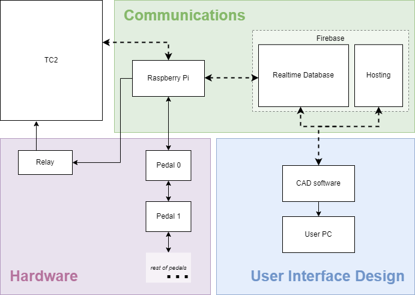
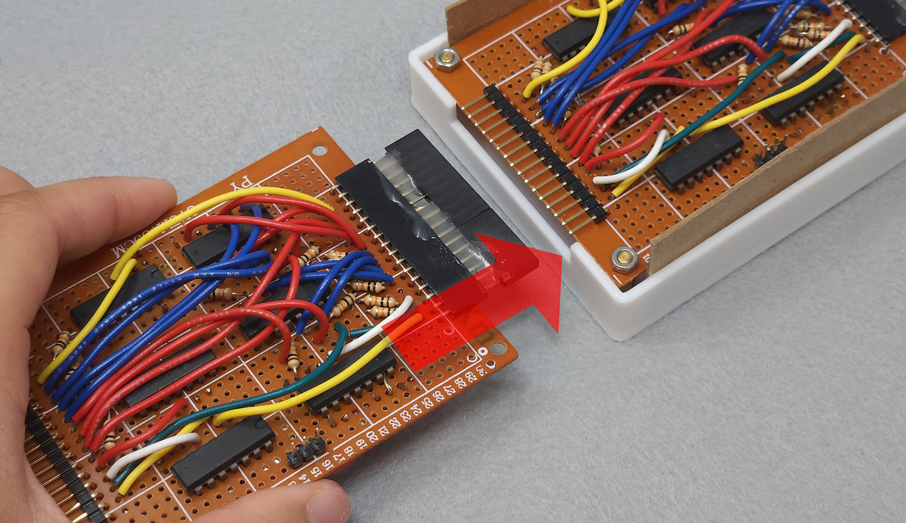
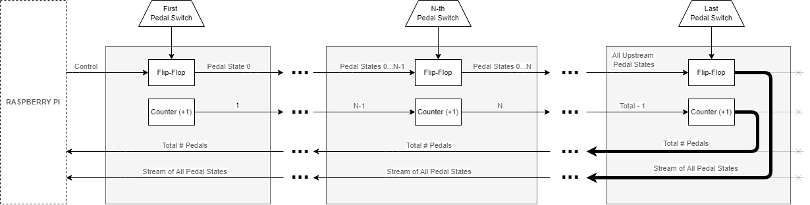
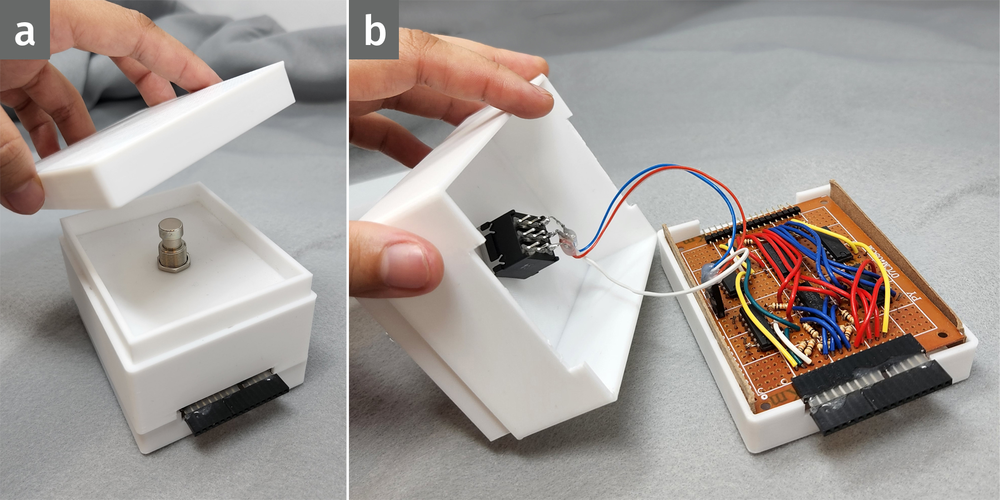

## Project Overview

The Loom Pedals are a hardware peripheral interface for the TC2 digital Jacquard loom by Tronrud Engineering. They have been designed as a modular system of foot pedals, similar to guitar effects pedals used by musicians, which are connected via a Raspberry Pi to a web-based open source weaving software, AdaCAD.

### GitHub repositories
* [Hardware](https://github.com/UnstableDesign/Loom-Pedals-Hardware/)
* [Driver Software](https://github.com/UnstableDesign/Loom-Pedals-Raspberry-Pi)
* [AdaCAD Extension](https://github.com/UnstableDesign/Loom-Pedals-AdaCAD)

This page currently focuses on describing and documenting the Loom Pedals system as it evolves. We are also working on a [developer's guide](sections/dev-guide.md) to support any interested makers.

### Table of Contents

[Section A: Project Fundamentals](#section-a-project-fundamentals)

1. [Weaving, Jacquard looms, and TC2 basics](#weaving-jacquard-looms-and-tc2-basics)
2. Dependencies
3. Installation and assembly
4. Prerequisite skills for developers
5. Open source disclosure (?)

[Section B: System Components](#section-b-system-components)

1. Overview
2. Hardware
  * Circuit design
  * Enclosure design
3. Driver software
  * File organization
  * Physical pedals
  * Virtual pedals
  * TC2 connection *(not yet public)*
  * Database connection
4. AdaCAD integration
  * Services
  * Component

Section C: Current and Future Work

1. Refactoring operations in AdaCAD
2. Physical enclosure improvements/alternate form factors
3. Adding analog inputs (e.g. dials, sliders)
4. Experimenting with output display: thermal printer

## Previous Version

V1 of the loom pedals was built in Fall 2019 by reimplementing Processing (Java) code from Lea (see acknowledgments) in Python/QT as a proof-of-concept for an improved GUI with multiple pedals on a Raspberry Pi.

## Acknowledgments

These pedals would not have been possible without the initial work of Lea Albaugh, whose Summer 2019 experiments in underdetermined, improvisational weaving interactions on the TC2 are documented on [their site here](http://www.lea.zone/underdetermined_handweaving.html "Underdetermined Handweaving"). Thank you, also, to Tronrud for engineering such a nifty Jacquard loom for experimental weaving. And finally, thank you to our lab's loom -- Jean-Luc Jacquard. 



## Section B: System Components

Each component of the loom pedals system is in its own repository. These sections are also roughly organized in the chronological order in which I built each component.

### Overview

### Hardware

The loom pedals I describe represent "V2" of the system. V1 was the first time I implemented the combination of pedals, Raspberry Pi, and TC2 for a class project, which you can find \[on its own project page.\]

#### Circuit design

The pedals are designed to be modular and interchangeable, linking up in series, with the first pedal directly connected to the Pi.

The circuitry in the pedals shown are implemented with off-the-shelf digital logic IC's and hand-soldering to a perfboard, but a PCB is in the works, because it's probably not good for me to inhale all of these fumes.

#### Enclosure design

The enclosure's CAD files are on GitHub. Many many thanks to Lily Gabriel for modelling and 3D-printing the enclosures much faster than I would have.

This version of the enclosure is a sort of *minimum viable prototype*, and it would definitely be interesting to try different form factors.

### Raspberry Pi software

The Raspberry Pi serves as the system's communication hub: it drives the pedals hardware and maintains wireless connections to both the TC2 and the cloud-based design/control software (AdaCAD). These three connections are handled by continuously running a Node.JS program while using the loom, and each connection has its own module in the program.

#### File organization

The [repository](https://github.com/UnstableDesign/Loom-Pedals-Raspberry-Pi) is divided into the following sub-folders (modules).

##### `0_main` Main program

Currently, each configuration of the Loom Pedals hardware (i.e. virtual or physical pedals) must run a separate `main` program. 

##### `1_pedals` Pedals driver

Uses the Raspberry Pi's GPIO pins to drive the pedal devices.

##### `2_loom` TC2 connection

*This module is not yet public.*

##### `3_db` Database connection

Connects to a Firebase realtime database and updates it with data pertaining to the TC2, pedals, and user inputs.

#### Virtual pedals

The Loom Pedals system can be used without any of the aforementioned hardware (Raspberry Pi, pedal circuitry) through the **virtual pedals** option. These pedals are hosted within the design software.

### AdaCAD integration: design software interface

See 

<!-- fill in -->

## Obsidian Links
	[[a_fundamentals]] [[electronics]] [[programming]] [[projects]]