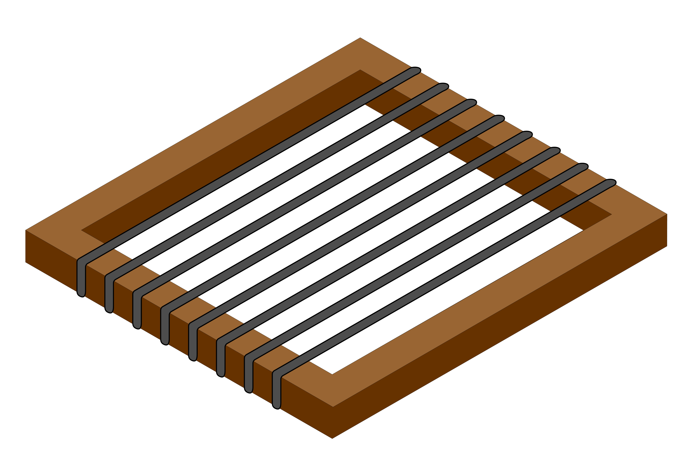
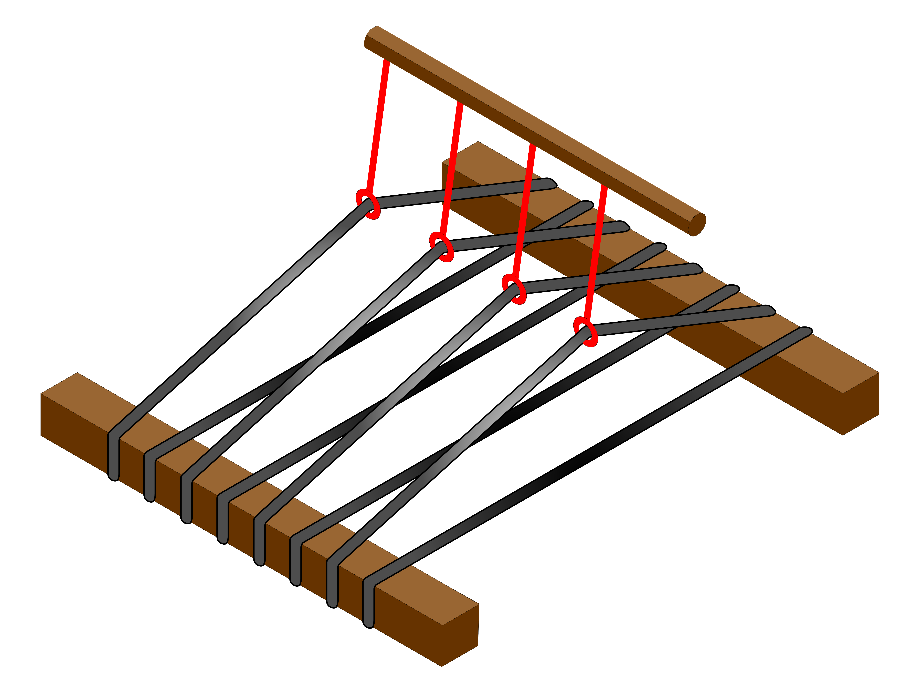
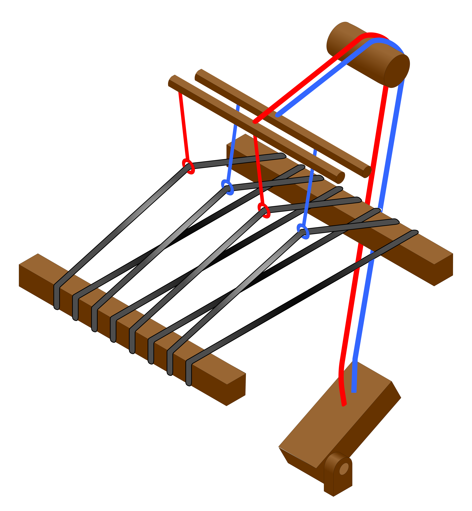

## Project Overview

The loom pedals are a hardware peripheral interface for the TC2 digital Jacquard loom by Tronrud Engineering. They have been designed as a modular system of foot pedals, similar to guitar effects pedals used by musicians, which are connected via a Raspberry Pi to a web-based open source weaving software, AdaCAD.

### [GitHub repository](https://github.com/UnstableDesign/Loom-Pedals/)

### Table of Contents

[Section A: Project Fundamentals](#section-a-project-fundamentals)

[1. Weaving, Jacquard looms, and TC2 basics](#looms-jacquard-frame-and-other-types)
2. Dependencies
3. Installation and assembly
4. Prerequisite skills for developers
5. Open source disclosure (?)

Section B: System Components

1. Hardware
  i. Circuit design
  ii. Enclosure design
2. Raspberry Pi software
  i. Pedals driver
  ii. TC2 connection *(not yet public)*
  iii. Database connection
3. AdaCAD integration
  i. Services
  ii. Component

Section C: Current and Future Work

1. Refactoring operations in AdaCAD
2. Physical enclosure improvements/alternate form factors
3. Adding analog inputs (e.g. dials, sliders)
4. Experimenting with output display: thermal printer

## Previous Version

V1 of the loom pedals was built in Fall 2019 by reimplementing Processing (Java) code from Lea (see acknowledgments) in Python/QT as a proof-of-concept for an improved GUI with multiple pedals on a Raspberry Pi.

## Acknowledgments

These pedals would not have been possible without the initial work of Lea Albaugh, whose Summer 2019 experiments in underdetermined, improvisational weaving interactions on the TC2 are documented on [their site here](http://www.lea.zone/underdetermined_handweaving.html "Underdetermined Handweaving"). Thank you, also, to Tronrud for engineering such a nifty Jacquard loom for experimental weaving. And finally, thank you to our lab's loom -- Jean-Luc Jacquard. 

## Section A: Project Fundamentals

I'm gonna force anyone engaging with this project to first learn how weaving works.

### Weaving, Jacquard looms, and TC2 basics

Tronrud's TC2 is a digital Jacquard loom. Let's break that phrase down, starting with the "loom" part. A **loom** is a tool for weaving, which is a fiber craft that interlaces yarns to create cloth. 

Quick disclaimer on language: there are many forms of weaving across cultures and materials, as well as a few different ways to define "yarn" or "fabric" or "cloth" or any other craft-related term. With things that have evolved through so much history that they are at once universal, yet diverse, there are bound to be exceptions or special cases of definitions. I'll be generalizing the most common forms of weaving in my experience, which may be western-/Euro-centric because I learned to weave in an English-speaking, American, digital setting -- not coincidentally, this type of weaving is also the most prevalent in industrial textiles.

<!-- add citations to craft books throughout -->

#### Woven structures

\[_citations to craft books throughout_\] 

Weaving mainly interlaces two sets of yarn in perpendicular directions. \[picture of plainweave\] Conventionally, if we take one set to be vertical and one to be horizontal, the vertical set of yarns is called the **"warp"** and the horizontal set is the **"weft"**. (A catchy saying is "weft goes from left to right") \[source?\] On many looms, the warp is tilted away from the weaver, or lying flat, so the "vertical" direction is rather towards/away from the weaver rather than up/down. The warp is first set up on the loom ("warping" the loom). Then, the weft is inserted perpendicular to the warp, travelling over and under to form a row of weaving.

\[make ILLUSTRATIONS\]

There are many different ways to weave these sequences of overs-and-unders and thus achieve a variety of patterns and structures in the cloth. The simplest structure is **plainweave**, also called "tabby". To make plainweave, the weft first goes over one warp, under one warp, over one, under one, alternating over and under through the whole row. In the next row, the weft will go underneath a warp if it had gone over in the previous row, and over a warp if it had gone under previously. The weaver alternates between these two rows as many times as needed. You can imagine that if the weft "goes over two, under one" or any other pattern of overs-and-unders, the weaving would produce a different structure.

We can represent these patterns as **drafts**, a standard grid-based notation for woven structures. In a draft, a white square represents where the weft is over the warp, while a black square represents where the warp is on top. So a row of squares represents a single pass of the weft, while a column represents how an individual warp behaves during weaving.

#### Looms: Jacquard, frame, and other types

\[make ILLUSTRATIONS\]

I didn't mention what tools were used to make the woven structures in the last section, because many types of looms can be used to achieve the same structure. \[cite Albers\] To build up to what a "Jacquard" loom is, we can start with the most fundamental loom, which is a rectangular frame that holds the warp yarns in parallel. If you're following along anyway, go grab a picture frame/hardcover book/two ladder rungs and wrap some yarn around the item, leaving some space between each wrap. Bam, loom. 

To weave, you can use a needle to manually go over and under the warps, or simply manipulate the weft with your fingers. Many **tapestry looms** (see photos) /[add photos/] simply use these components.

We can make weaving on our loom faster by adding a way to lift multiple warps at a time, e.g. by tying loops around each set of yarns that would lift in one row of the pattern, then tying these loops to a single rod, we can lift all of the yarns that the weft should go under in that row. A **shed** is the gap that forms between the raised warps and lower warps. These loops that raise and lower warp yarns are **heddles**, which can be made of wire, string, or cut out of wood. A set of heddles that lift together form a **frame** or **shaft**, as they are all attached to a common part. 

Since each heddle can only be attached to one shaft, a loom with multiple shafts will create a different shed for each one lifted. Most of these looms are categorized as **frame looms** (see photos), typically found in 2-shaft, 4-shaft, 8-shaft, and 16-shaft configurations.

\[photos\]

As an aside, I shouldn't ignore heddles on other types of looms, as these variations show how useful the mechanism is. The illustrated heddle shaft most closely resembles a set of string heddles on backstrap looms. \[photos\]

However, cloth woven on a shaft loom will usually make use of patterns that are much more varied than the number of shafts. How can we accomplish this complexity? By lifting multiple shafts at a time. Imagine that our loom's shaft now have ropes attached to the top, so we can raise them by tugging on the rope. If we hold the ropes from multiple shafts, all of those shafts will lift when we pull. With some clever engineering, we route these ropes down to the floor and attach them to a foot pedal that acts as a lever. We have just built a **treadle**. 

### Dependencies

<!-- fill in -->